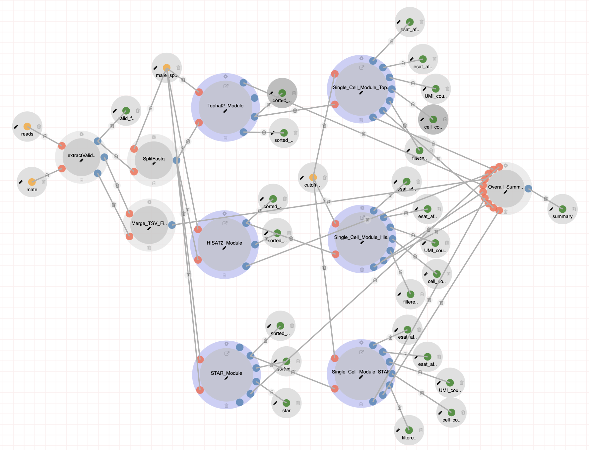
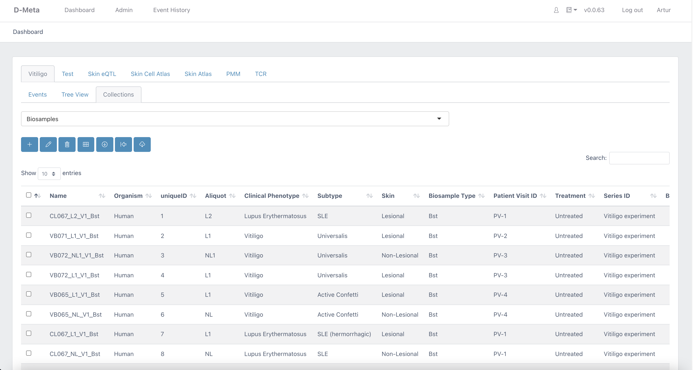

All raw sequencing data and associated metadata of samples from affected and unaffected skin from vitiligo patients, as well as healthy controls, are currently hosted at DolphinSuite, a novel high throughput data analysis platform. 

Raw sequenced data was processed by the scRNA-Seq inDrop pipeline developed within the interactive pipeline manager <a href="https://bmcgenomics.biomedcentral.com/articles/10.1186/s12864-020-6714-x">DolphinNext</a>. A downloadable container of all required sofware and R libraries of the inDrop Pipeline can be found in both Docker Hub and GitHub. 

* **Docker Hub**: <a href="https://hub.docker.com/repository/docker/dolphinnext/indrop" target="_blank">https://hub.docker.com/repository/docker/dolphinnext/indrop</a> 
* **GitHub**: <a href="https://github.com/dolphinnext/indrop" target="_blank">https://github.com/dolphinnext/indrop</a>  

# DolphinSuite Platforms

<a href="https://www.umassmed.edu/biocore/" target="_blank">UMass Chan Medical School BioCore</a> has developed **DolphinSuite**, a platform to support the analysis of high throughput data. DolphinSuite supports the full research cycle by allowing users to track samples from sample collection to data processing (sequencing, proteomics, metabolomics) and finally to interactive analysis using an intuitive web interface. DolphinSuite is built to ensure secure access to the processed data using 3rd party applications for tailor-made analysis and data sharing. 

DolphinSuite is comprised of three major components that supports distinct aspects of high throughput data analysis. 
      
<table>
<tbody>
  <tr>
   <td style="text-align:center;width:33%; vertical-align: text-top;"> 
      
 <a href="https://dolphinnext.umassmed.edu/index.php" target="_blank" style="font-size: 1.5em;">DolphinNext (Dnext)</a> 

      
       
      
 **Dnext**: a distributed data processing platform for high throughput genomics 

       
      <button type="button" class="btn btn-info" onclick="window.open('https://dolphinnext.umassmed.edu/index.php?np=1&id=830')">Dnext inDrop Pipeline</button>
       
   </td>
   <td style="text-align:center;width:33%; vertical-align: text-top;"> 
      
 <a href="https://github.com/UMMS-Biocore/dmeta" target="_blank" style="font-size: 1.5em;">DolphinMeta (Dmeta)</a> 

      
       
      
 **Dmeta**: automated data processing and management using ontology-based metadata tracking system 

      <button type="button" class="btn btn-info" onclick="window.open('https://dmeta-skin.dolphinnext.com/')">Vitiligo in Dmeta</button>
       
   </td>
   <td style="text-align:center;width:33%; vertical-align: text-top;"> 
      
 <a href="https://github.com/UMMS-Biocore/dportal" target="_blank" style="font-size: 1.5em;">DolphinPortal (Dportal)</a> 

      
       
      
 **Dportal**: a user-friendly and interactive data browser for filtering and querying

       
      <button type="button" class="btn btn-info" onclick="window.open('https://dportal-skin.dolphinnext.com/')">Vitiligo in Dportal</button>
       
   </td>
  </tr>
</tbody>
</table>

 
 